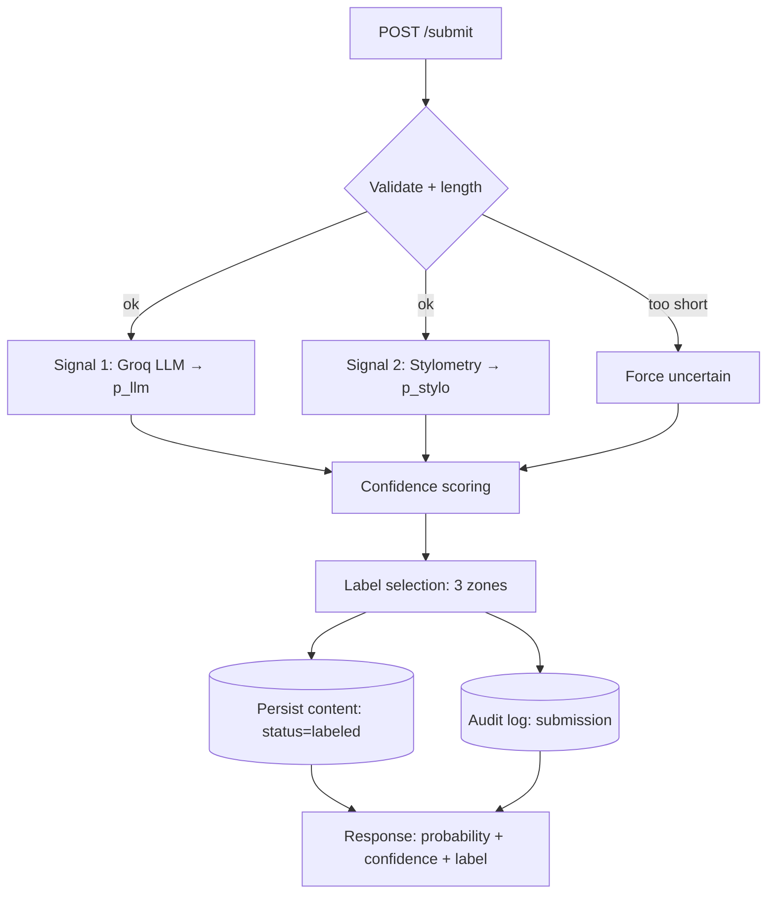

# Provenance Guard — Planning & Specification

> Content-attribution service. A creator submits text; the system estimates whether
> it was AI-generated or human-written, returns a **calibrated confidence score** and a
> **plain-language transparency label**, records every decision in an **audit log**, and
> lets creators **appeal** a classification. This document is the spec that drives code
> generation in Milestones 3–5. No code is written yet.

---

## 0. Contents

1. [System Overview](#1-system-overview)
2. [Architecture](#architecture) — narrative, diagrams, API contract
3. [Detection Signals](#3-detection-signals-spec-question-1)
4. [Uncertainty & Confidence Scoring](#4-uncertainty--confidence-scoring-spec-question-2)
5. [Transparency Label Design](#5-transparency-label-design-spec-question-3)
6. [Appeals Workflow](#6-appeals-workflow-spec-question-4)
7. [Anticipated Edge Cases](#7-anticipated-edge-cases-spec-question-5)
8. [Rate Limiting Plan](#8-rate-limiting-plan)
9. [Audit Log & Data Model](#9-audit-log--data-model)
10. [AI Tool Plan](#ai-tool-plan)

---

## 1. System Overview

**The problem.** Platforms increasingly need to tell readers whether a piece of writing
was produced by a human or an AI — but detection is probabilistic, error-prone, and
socially consequential. A wrong "AI-generated" label on a human writer's work is a
reputational harm. So Provenance Guard is designed around three principles:

1. **Never claim certainty it doesn't have.** Every output carries a confidence score and
   an honest "this is an estimate, not proof" message.
2. **Multiple independent signals.** A holistic semantic judgment (LLM) *and* a structural
   statistical judgment (stylometry) must roughly agree before the system makes a strong
   public claim. Disagreement is treated as uncertainty, not averaged away.
3. **Recourse and accountability.** Creators can appeal; every decision and appeal is
   written to an immutable-style audit log.

**Seven required features and how they connect:**

| # | Feature | Where it lives in the flow |
|---|---------|----------------------------|
| 1 | Content submission endpoint | `POST /submit` — entry point |
| 2 | Multi-signal detection (≥2) | Signal 1 (LLM) + Signal 2 (stylometry) inside `/submit` |
| 3 | Confidence scoring w/ uncertainty | Scoring stage — combines signals into `ai_probability` + `confidence` |
| 4 | Transparency label | Label-selection stage — turns scores into one of 3 variants |
| 5 | Appeals workflow | `POST /appeal` — flips status to `under_review`, logs it |
| 6 | Rate limiting | Flask-Limiter decorators on `/submit` and `/appeal` |
| 7 | Audit log | Every decision + appeal writes a structured row; `GET /log` reads it |

---

## Architecture

**Narrative — the path one piece of text takes.**
A creator sends raw text to `POST /submit`. The request first passes **input validation**
(non-empty, length check; very short texts are flagged for forced uncertainty). The text is
then analyzed by **two independent detectors in sequence**: **Signal 1**, a Groq
`llama-3.3-70b-versatile` classifier that returns a probability the text is AI-generated plus
a short rationale, and **Signal 2**, a pure-Python **stylometric** analyzer that returns a
probability from measurable writing statistics. The **confidence-scoring** stage combines the
two probabilities into a single `ai_probability`, measures how much the two signals
**disagree**, and derives a **confidence** value that is penalized when the signals conflict.
The **label-selection** stage maps `ai_probability` + `confidence` to one of three
**transparency-label** variants and renders its exact display text. Finally the system
**persists** a content record (status `labeled`) and writes a structured **audit-log** entry,
then returns the full result to the caller.

For the **appeal flow**, the creator sends the `content_id` plus their reasoning to
`POST /appeal`. The system validates the id, snapshots the original decision, writes an
**appeal record**, flips the content's status from `labeled` to **`under_review`**, writes an
`appeal_received` **audit-log** entry, and returns a confirmation. No automated
re-classification occurs — the item now waits in a human **review queue** (`GET /review`).

### Diagram — Submission flow

```
                              POST /submit  { text, creator_id? }
                                        │
                                        ▼
                          ┌───────────────────────────┐
              raw text →  │  Input validation + length │ → too short? force "uncertain"
                          └───────────────────────────┘
                                        │ raw text
                        ┌───────────────┴───────────────┐
                        ▼                                ▼
          ┌───────────────────────────┐    ┌───────────────────────────┐
 SIGNAL 1 │ LLM classifier (Groq       │    │ Stylometric heuristics     │ SIGNAL 2
          │ llama-3.3-70b-versatile)   │    │ (pure Python)              │
          │ → p_llm ∈ [0,1] + rationale│    │ → p_stylo ∈ [0,1] + feats  │
          └───────────────────────────┘    └───────────────────────────┘
                        │ p_llm                          │ p_stylo
                        └───────────────┬───────────────┘
                                        ▼
                          ┌───────────────────────────┐
                          │ Confidence scoring         │  ai_probability = 0.60·p_llm+0.40·p_stylo
       p_llm, p_stylo  →  │  • combine → ai_probability │  disagreement   = |p_llm − p_stylo|
                          │  • disagreement penalty     │  confidence     = max(p,1−p)·(1−0.5·disagree)
                          │  → ai_probability, confidence│
                          └───────────────────────────┘
                                        │ ai_probability, confidence
                                        ▼
                          ┌───────────────────────────┐
                          │ Label selection (3 zones)  │  → label_variant + label_text
                          └───────────────────────────┘
                                        │ full result
                        ┌───────────────┴───────────────┐
                        ▼                                ▼
          ┌───────────────────────────┐    ┌───────────────────────────┐
          │ Persist content record     │    │ Write audit-log entry      │
          │ status = "labeled"         │    │ event = "submission"       │
          └───────────────────────────┘    └───────────────────────────┘
                                        │
                                        ▼
             Response { content_id, ai_probability, confidence,
                        label_variant, label_text, signals{...} }
```

### Diagram — Appeal flow

```
        POST /appeal  { content_id, reason, creator_id? }
                        │ content_id
                        ▼
          ┌───────────────────────────┐
          │ Validate content_id exists │ → 404 if unknown
          └───────────────────────────┘
                        │ original decision snapshot
                        ▼
          ┌───────────────────────────┐
          │ Create appeal record       │  appeal_id, reason, original label/confidence
          └───────────────────────────┘
                        │
                        ▼
          ┌───────────────────────────┐
          │ Status: labeled → UNDER_REVIEW
          └───────────────────────────┘
                        │
                        ▼
          ┌───────────────────────────┐
          │ Write audit-log entry      │  event = "appeal_received"
          └───────────────────────────┘
                        │
                        ▼
     Response { appeal_id, content_id, status:"under_review" }
                        │
                        ▼
        (waits in) GET /review  ← human reviewer queue
```

### Mermaid (same submission flow, for rendering)



### API surface (the contract all code implements)

| Method & path | Accepts | Returns | Rate limit |
|---|---|---|---|
| `POST /submit` | `{ "text": str, "creator_id"?: str }` | `{ content_id, ai_probability, confidence, label_variant, label_text, signals: { p_llm, p_stylo, features, llm_rationale }, status }` | 10/min, 100/day |
| `POST /appeal` | `{ "content_id": str, "reason": str, "creator_id"?: str }` | `{ appeal_id, content_id, status: "under_review" }` | 5/min, 20/day |
| `GET /log` | — (optional `?limit=`) | `[{ id, timestamp, event_type, content_id, ai_probability, confidence, label_variant, signals, detail }...]` | 30/min |
| `GET /review` | — | `[{ appeal_id, content_id, reason, original_label, original_confidence, text_excerpt, created_at }...]` | 30/min |
| `GET /content/<id>` | path id | full content record + decision | 30/min |
| `GET /health` | — | `{ status: "ok" }` | default |

**Response shape for `/submit` (canonical example):**

```json
{
  "content_id": "c_8f2a1b",
  "ai_probability": 0.872,
  "confidence": 0.82,
  "confidence_band": "high",
  "label_variant": "high_confidence_ai",
  "label_text": "Likely AI-generated. Our system estimates ...",
  "status": "labeled",
  "signals": {
    "p_llm": 0.92,
    "p_stylo": 0.80,
    "disagreement": 0.12,
    "features": { "sentence_length_variance": 0.14, "type_token_ratio": 0.31,
                  "punctuation_diversity": 0.18, "avg_sentence_length": 21.3 },
    "llm_rationale": "Uniform sentence rhythm, hedged transitions, generic diction."
  }
}
```

---

## 3. Detection Signals (Spec Question 1)

The system uses **two genuinely independent signals**: one **semantic/holistic**, one
**structural/statistical**. They fail in different ways, so their *agreement* is meaningful.

### Signal 1 — LLM classifier (Groq `llama-3.3-70b-versatile`)

- **What it measures:** a holistic, semantic read of the text — does it *sound* AI-generated?
  Captures things statistics miss: generic diction, over-smooth transitions, hedging
  ("it's important to note"), balanced-but-hollow structure, lack of specific lived detail.
- **Output:** we prompt the model to return **strict JSON** `{ "p_ai": 0.0–1.0, "rationale": "..." }`.
  So the signal's output is a single probability `p_llm ∈ [0,1]` plus a one-sentence reason
  (the reason is logged, never shown as proof to the reader).
- **Why the property differs:** models are trained to produce high-probability, "average"
  phrasing; that produces a recognizable smoothness and cliché density that differs from the
  idiosyncrasy of human authorship.
- **Blind spot (must be stated):** LLM self-assessment is **unstable and overconfident** — it
  can rate the same text differently across runs, is easily fooled by AI text prompted to be
  "quirky," and may flag polished human writing (academic, legal) as AI. It also has weak
  ground truth: it is guessing, not measuring. We reduce (never eliminate) this by asking for
  a probability rather than a yes/no, using temperature 0, and corroborating with Signal 2.

### Signal 2 — Stylometric heuristics (pure Python, no libraries)

Measurable statistical properties of the text. Each sub-feature is normalized to a `[0,1]`
"AI-likeness" contribution; their weighted mean is `p_stylo ∈ [0,1]`.

| Feature | What it captures | Human vs AI tendency |
|---|---|---|
| **Sentence-length variance (burstiness)** | rhythm variability across sentences | humans burst (mix 3-word and 40-word sentences); AI is uniform → **low variance ⇒ more AI-like** |
| **Type-token ratio (TTR)** | vocabulary diversity (unique/total words) | humans reuse/repeat unevenly; AI keeps a steady, moderate diversity |
| **Punctuation diversity/density** | use of dashes, semicolons, parentheses, ellipses | humans use varied, sometimes idiosyncratic punctuation; AI is regular and comma-heavy |
| **Average sentence length / complexity** | structural evenness | AI clusters near a comfortable mean length |

- **What it measures:** structure and statistics only — it never "reads" meaning.
- **Output:** `p_stylo ∈ [0,1]` + the raw feature values (logged and returned).
- **Why the property differs:** AI decoding optimizes locally-probable tokens, which
  statistically flattens variance ("low burstiness"); human writing is measurably burstier.
- **Blind spot (must be stated):** pure statistics are **genre-blind and length-sensitive**.
  Poetry, song lyrics, lists, aphorisms, or intentionally repetitive human writing look
  "uniform" and score AI-like (false positive). Short texts (<~40 words) don't have enough
  sentences for stable variance. Heavily human-edited AI text regains burstiness (false
  negative). It also can't detect meaning, plagiarism, or partial authorship.

### Why this pairing (independence)

Signal 1 is **semantic** (what the text *means/sounds like*); Signal 2 is **structural**
(how the text is *shaped*). A poem might fool Signal 2 (uniform) but not Signal 1 (reads
human); a dry academic paragraph might lean AI on Signal 2 but the LLM may recognize domain
specificity. Because their errors are uncorrelated, **agreement raises confidence and
disagreement lowers it** — see §4.

### Combining the signals

```
ai_probability = 0.60 · p_llm + 0.40 · p_stylo
```

Weighting rationale: the LLM sees semantics the statistics can't, so it gets the larger
weight (0.60); stylometry is a cheaper, more stable corroborator (0.40). Weights are a
tunable constant, revisited after the §4 validation run.

---

## 4. Uncertainty & Confidence Scoring (Spec Question 2)

The core requirement: a 0.51 result must behave differently from a 0.95 result. We report
**two numbers** and treat **signal disagreement as real uncertainty.**

### The two numbers

1. **`ai_probability` (p)** — combined probability the text is AI-generated, `[0,1]`.
2. **`confidence` (C)** — how sure we are of the *direction* of that call, `[0,1]`.

```
disagreement = | p_llm − p_stylo |            # 0 = signals agree, 1 = total conflict
directional  = max(p, 1 − p)                  # 0.5 (coin flip) … 1.0 (extreme)
confidence   = directional · (1 − 0.5 · disagreement)     # conflict drags confidence down
```

**What confidence = 0.6 means to the system:** the signals lean one direction but *not
strongly enough, or not in enough agreement,* to make a confident public claim. It is a
"leaning but not sure" state → it renders the **Uncertain** label, not a directional one.
Confidence bands (for the label's plain-language wording):

| Confidence C | Plain word shown | Behavior |
|---|---|---|
| ≥ 0.85 | "high confidence" | strong directional label |
| 0.75 – 0.85 | "good confidence" | directional label (still high-confidence variant) |
| 0.60 – 0.75 | "low confidence" | **Uncertain** label |
| < 0.60 | "very low confidence" | **Uncertain** label |

### Thresholds — three zones (not a binary flip at 0.5)

```
if word_count < 40:                         → UNCERTAIN (forced; too little signal)
elif ai_probability ≥ 0.65 and C ≥ 0.75:    → HIGH-CONFIDENCE AI
elif ai_probability ≤ 0.35 and C ≥ 0.75:    → HIGH-CONFIDENCE HUMAN
else:                                       → UNCERTAIN
```

Note the design: a text can score `ai_probability = 0.70` (in the AI band) yet still land in
**Uncertain** if the two signals conflict enough to pull `C` below 0.75. That is intentional —
it is how "genuine uncertainty" is expressed instead of a hard 0.5 cutoff.

### Worked examples (shows scores are meaningful, not cosmetic)

| Case | p_llm | p_stylo | ai_probability | disagree | confidence | Label |
|---|---|---|---|---|---|---|
| Clear AI | 0.92 | 0.80 | 0.872 | 0.12 | 0.82 | **High-confidence AI** |
| Clear human | 0.10 | 0.20 | 0.140 | 0.10 | 0.82 | **High-confidence human** |
| Signals conflict | 0.85 | 0.20 | 0.590 | 0.65 | 0.40 | **Uncertain** (conflict) |
| Genuine middle | 0.55 | 0.48 | 0.522 | 0.07 | 0.50 | **Uncertain** (middle band) |

The conflict row is the important one: average alone (0.59) would wrongly read "leaning AI,"
but the disagreement penalty collapses confidence to 0.40 → honestly labeled Uncertain.

### How we'll test whether the scores are meaningful (validation plan)

1. **Curate a mini-corpus (~20–30 samples):** human set (classic-literature excerpts,
   personal blog posts, our own writing) + AI set (Groq/ChatGPT output across genres:
   essay, story, product blurb).
2. **Separation check:** AI samples should cluster at high `ai_probability`/high `C`; human
   samples at low `ai_probability`/high `C`. Plot/table the distribution.
3. **Monotonicity check:** take one AI paragraph, progressively human-edit it (vary sentence
   length, add specific detail); `ai_probability` should fall step by step, not jump.
4. **Uncertainty check:** feed known-hard inputs (a repetitive poem, a 15-word tweet, a
   formal abstract) and confirm they land in **Uncertain** with lowered `C`, not a confident
   wrong label.
5. Record results in the README; retune weights (0.60/0.40) and thresholds if separation is
   poor. Success = clear AI/human cluster apart, hard cases land Uncertain.

---

## 5. Transparency Label Design (Spec Question 3)

Design goals: plain language, honest about being an *estimate*, confidence made meaningful to
a non-technical reader (word **and** percentage), and always an appeal path. `{confidence}` is
`round(C·100)`; `{band}` is the plain word from the §4 table. Each variant also has a
suggested visual (icon/color) noted for the UI, but the **text below is the required spec.**

### Variant A — High-confidence AI  (`label_variant: "high_confidence_ai"`)
> **Likely AI-generated.**
> Our system estimates this text was mostly produced by an AI writing tool
> (**{band} — {confidence}% confidence**). This estimate combines an AI-language analysis
> with statistical writing-pattern checks. It is an automated estimate, **not proof**, and it
> can be wrong. If you wrote this yourself, you can **appeal this label**.
>
> *Visual: robot/spark icon, amber accent.*
> *Example render (C=0.82): "Likely AI-generated … good confidence — 82% confidence …"*

### Variant B — High-confidence human  (`label_variant: "high_confidence_human"`)
> **Likely human-written.**
> Our system found no strong signs of AI generation in this text
> (**{band} — {confidence}% confidence**). This estimate combines an AI-language analysis
> with statistical writing-pattern checks. It is an automated estimate, **not a guarantee**.
> If you disagree with this label, you can **appeal it**.
>
> *Visual: pen/quill icon, green accent.*
> *Example render (C=0.82): "Likely human-written … good confidence — 82% confidence …"*

### Variant C — Uncertain  (`label_variant: "uncertain"`)
> **Attribution uncertain.**
> Our system could **not reliably determine** whether this text was written by a human or an
> AI (**{band} — {confidence}% confidence**). The signals were weak, in disagreement, or the
> text was too short to judge. We are **not** labeling this content as either. You may add a
> voluntary disclosure, or **request a human review**.
>
> *Visual: question-mark icon, grey accent.*
> *Example render (C=0.50): "Attribution uncertain … very low confidence — 50% confidence …"*

Why three variants and not a slider: readers need a clear takeaway, but the **percentage +
band** keeps the nuance. The Uncertain variant is deliberately the graceful default so a
borderline human writer is never publicly branded "AI."

---

## 6. Appeals Workflow (Spec Question 4)

- **Who can appeal:** the content creator/submitter, referencing the `content_id` returned at
  submission (optionally identifying themselves with `creator_id`). No account system for the
  free build; possession of the `content_id` is the handle.
- **What they provide:** `content_id`, a free-text **`reason`** (their statement / evidence,
  e.g. "I wrote this; drafts available"), and optional `creator_id`/contact.
- **What the system does on receiving an appeal (atomic sequence):**
  1. Validate `content_id` exists (else `404`).
  2. Snapshot the **original decision** (label_variant, ai_probability, confidence, p_llm,
     p_stylo) so the appeal preserves what was contested.
  3. Create an **appeal record** (`appeal_id`, content_id, reason, timestamp, snapshot).
  4. **Update content status:** `labeled` → **`under_review`**.
  5. Write an **audit-log** entry, `event_type = "appeal_received"`, including the reason and
     the original decision.
  6. Return `{ appeal_id, content_id, status: "under_review" }`.
- **No automated re-classification** (per requirements) — the item now waits for a human.
- **What a reviewer sees (`GET /review`):** the appeal queue — for each open appeal: the
  `content_id`, a text excerpt, the original label + confidence + **per-signal breakdown**
  (so the reviewer can see *why* the system decided as it did), the creator's reasoning, and
  timestamps. Resolution actions (uphold/overturn) are out of scope for this build but the
  status field (`under_review` → `resolved`) leaves room for them.

---

## 7. Anticipated Edge Cases (Spec Question 5)

Specific failure scenarios (not generic "it might be wrong"), each traced through the system.

1. **Repetitive, simple-vocabulary poetry (e.g., a villanelle or nursery-rhyme).**
   Refrains + short even lines + small vocabulary → **low burstiness, low TTR** → Signal 2
   scores it strongly AI-like. But it is human art. *Trace:* Signal 1 (LLM) likely reads it as
   human → large `disagreement` → confidence penalty drops `C` → lands **Uncertain**, not a
   false "AI" brand. The creator can still appeal. This case is why disagreement lowers
   confidence instead of averaging.

2. **Very short text (<40 words — a tweet, a caption).**
   Too few sentences for stable variance; the LLM has little to judge. *Trace:* the length
   gate forces **Uncertain** with lowered `C` and the label notes "text was too short to
   judge." Prevents confident nonsense on thin input.

3. **False-positive on formal human writing (academic abstract / legal prose) — the harm case.**
   Polished, hedged, uniform sentence length → *both* signals may lean AI. *Trace:* if they
   agree, `ai_probability` and `C` are both high → **High-confidence AI** label on a real
   human writer. This is the exact harm we must handle: the label text says "estimate, not
   proof" and offers appeal; the creator appeals; status flips to `under_review`; the audit
   log preserves the original signal breakdown so a reviewer can overturn it. We also
   deliberately set the AI threshold at **0.65 (not 0.50)** to reduce this false-positive rate,
   accepting more Uncertain labels as the trade-off.

4. **Human-edited AI text ("hybrid").** A person rewrites AI output, restoring burstiness and
   softening tells. *Trace:* both signals drift toward human → may be labeled human. The system
   **cannot** detect partial authorship and the README will state this limitation plainly; the
   label only ever claims a holistic estimate.

---

## 8. Rate Limiting Plan

Rate limiting protects the expensive, abusable paths (each `/submit` costs a Groq LLM call and
counts against free-tier limits) and prevents appeal-queue spam. Enforced per client IP with
Flask-Limiter (in-memory store for the dev build; a note in the README that production would
use Redis).

| Endpoint | Limit | Reasoning |
|---|---|---|
| `POST /submit` | **10 / minute, 100 / day** | Each call triggers a Groq LLM request (latency + token cost + free-tier caps). 10/min supports interactive testing and demos; 100/day bounds daily token spend and blocks scripted spam. |
| `POST /appeal` | **5 / minute, 20 / day** | Appeals are human actions and rare; a tight cap stops appeal-flooding / review-queue harassment. |
| `GET /log`, `/review`, `/content/<id>` | **30 / minute** | Read-only and cheap, but still bounded to discourage scraping the audit log. |
| Global default | **200 / day, 50 / hour** | Backstop for any endpoint without an explicit limit. |

Exceeding a limit returns HTTP **429** with a JSON message. Values are documented here and will
be restated in the README.

---

## 9. Audit Log & Data Model

Storage: **SQLite** (built-in, no setup). Three tables. Every attribution decision **and** every
appeal writes a structured `audit_log` row (§ feature 7). `GET /log` renders these rows; the
README will show ≥3 entries.

**`content`**
| column | type | notes |
|---|---|---|
| content_id | TEXT PK | e.g. `c_8f2a1b` |
| created_at | TEXT | ISO-8601 |
| text | TEXT | submitted text |
| word_count | INTEGER | for length gate |
| ai_probability | REAL | combined p |
| confidence | REAL | C |
| label_variant | TEXT | `high_confidence_ai` \| `high_confidence_human` \| `uncertain` |
| label_text | TEXT | rendered label |
| p_llm / p_stylo | REAL | per-signal scores |
| status | TEXT | `labeled` \| `under_review` \| `resolved` |

**`appeals`**
| column | type | notes |
|---|---|---|
| appeal_id | TEXT PK | e.g. `a_3c9d` |
| content_id | TEXT FK | → content |
| created_at | TEXT | ISO-8601 |
| reason | TEXT | creator's statement |
| creator_id | TEXT NULL | optional |
| original_label_variant | TEXT | snapshot |
| original_confidence | REAL | snapshot |
| status | TEXT | `open` \| `resolved` |

**`audit_log`** (append-only in practice)
| column | type | notes |
|---|---|---|
| id | INTEGER PK AUTOINCREMENT | |
| timestamp | TEXT | ISO-8601 |
| event_type | TEXT | `submission` \| `appeal_received` \| `status_change` |
| content_id | TEXT | |
| appeal_id | TEXT NULL | set for appeal events |
| ai_probability | REAL | |
| confidence | REAL | |
| label_variant | TEXT | |
| p_llm / p_stylo | REAL | signals used |
| signals_json | TEXT | full feature breakdown + LLM rationale |
| detail | TEXT | e.g. appeal reason, status transition |

---

## AI Tool Plan

How each implementation milestone will be prompted from this spec. General rule: **paste the
relevant spec section + the Architecture diagram** as context, ask for one focused unit, then
**verify in isolation** before wiring it in.

### M3 — Submission endpoint + first signal
- **Spec I'll provide:** §3 Detection Signals (Signal 1 sub-section) + §Architecture (submission
  diagram + API contract for `/submit`) + §9 (content/audit tables).
- **Ask for:** a Flask app skeleton with `POST /submit` (validation + length gate) and the
  **Signal 1** function `llm_score(text) -> {p_llm, rationale}` calling Groq
  `llama-3.3-70b-versatile` at temperature 0 with strict-JSON output; plus SQLite setup.
- **Verify:** call `llm_score()` directly on 3–4 hand-picked texts (obvious AI, obvious human,
  a poem) and confirm it returns parseable JSON with sane probabilities **before** wiring it
  into the endpoint. Confirm `/submit` returns the response shape in §Architecture.

### M4 — Second signal + confidence scoring
- **Spec I'll provide:** §3 (Signal 2 table + combining formula) + §4 Uncertainty & Confidence
  (formulas, thresholds, worked-examples table) + diagram.
- **Ask for:** the pure-Python **Signal 2** `stylometry_score(text) -> {p_stylo, features}` and
  the **scoring** function implementing `ai_probability`, `disagreement`, and `confidence`
  exactly as in §4.
- **Verify:** reproduce the four rows of the §4 worked-examples table (clear AI, clear human,
  conflict, middle) and confirm the computed confidence + zone match. Run the §4 validation
  mini-corpus and check AI vs human separate and hard cases land Uncertain.

### M5 — Production layer (labels, appeals)
- **Spec I'll provide:** §5 Label variants (all three exact texts + band mapping) + §6 Appeals
  workflow + §8 rate limits + diagram (appeal flow).
- **Ask for:** `select_label(ai_probability, confidence, word_count) -> {variant, text}` rendering
  all three variants with `{band}`/`{confidence}` substitution; the `POST /appeal` endpoint
  (validate → snapshot → appeal record → status `under_review` → audit entry); `GET /log` and
  `GET /review`; and Flask-Limiter decorators with the §8 values.
- **Verify:** craft inputs that reach **each** of the three label variants; submit then appeal a
  `content_id` and confirm status flips to `under_review` and an `appeal_received` row appears in
  `GET /log`; confirm a rapid loop of `/submit` returns HTTP 429 at the documented limit.

---

*End of spec. No implementation code is written until Milestone 3.*
